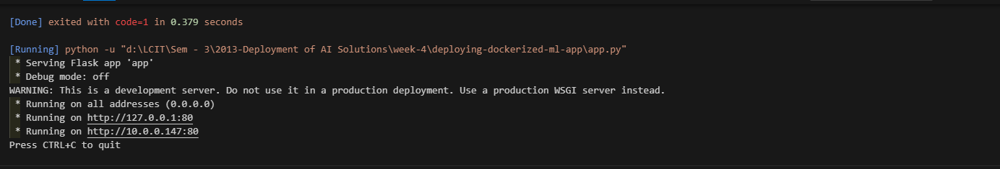

# deploying-dockerized-ml-app
Description: This repository contains a machine learning application developed using Flask, designed to demonstrate the deployment of a predictive model using Docker. The application leverages a ML classifier trained on the Iris dataset to make predictions based on user input.



# Dockerized Machine Learning Application

This repository contains a machine learning application developed using Flask, designed to demonstrate the deployment of a predictive model using Docker. The application leverages a ML classifier trained on the Iris dataset to make predictions based on user input.


## Repository Contents

- `app.py`: The main Flask application file that serves the ML model.
- `Dockerfile`: Instructions for building the Docker image for the application.
- `model.pkl`: The pre-trained machine learning model serialized as a pickle file.
- `requirements.txt`: List of Python dependencies required for the application.
- `train_model.py`: Script used to train the machine learning model.

## Getting Started

### Prerequisites

- Docker installed on your system
- Git for version control

### Installation and Running the Application

1. Clone the repository:
   ```
   git clone https://github.com/yourusername/deploying-dockerized-ml-app.git
   cd deploying-dockerized-ml-app
   ```

2. Build the Docker image:
   ```
   docker build -t ml-app .
   ```

3. Run the Docker container:
   ```
   docker run -p 5000:5000 ml-app
   ```

4. Access the application by navigating to `http://localhost:5000` in your web browser.

## Usage

The application provides a simple interface where users can input Iris flower measurements. Upon submission, the application uses the trained model to predict the Iris species.

## Development

To modify the model or retrain it:

1. Update the `train_model.py` script as needed.
2. Run the script to generate a new `model.pkl` file:
   ```
   python train_model.py
   ```
3. Rebuild the Docker image to include the new model.

## Contributing

Contributions to improve the application or documentation are welcome. Please feel free to submit a Pull Request.

## License

This project is open-source